# Temple administration guide

This guide is for the people who run the books of Shree Jagannath Temple, Sarjapura, Bengaluru. It covers every screen in the administration app, who may use it, and a worked example for each job.

The pictures are full screens of the live register, taken at desktop width. Names, amounts, and receipt numbers in the pictures are the records already in the books. They are examples of how a finished screen looks, not a script to copy line for line.

## Sign in

Open the app and sign in with the username and password an Admin gave you. The language switch on the sign-in card changes labels to English, Hindi, or Odia. Devotee names, amounts, and saved choices stay as they were typed.

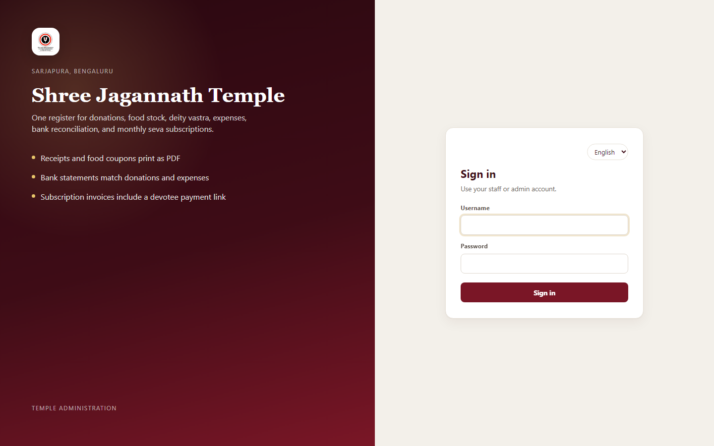

## The three roles

Everyone who is signed in can open the temple registers and the books. The difference is who may decide, and who may change the temple itself.

| Work | Staff | Treasurer | Admin |
| --- | --- | --- | --- |
| Record devotees, gifts, stock, vastra, expenses, coupons, and subscriptions | Yes | Yes | Yes |
| Design an invitation and email it to selected devotees | Yes | Yes | Yes |
| Print a receipt or a coupon sheet | Yes | Yes | Yes |
| Approve a waiting item up to ₹10,000 | No | Yes, if they did not prepare it | Yes, if they did not prepare it |
| Approve a waiting item above ₹10,000 | No | No | Yes, if they did not prepare it |
| Set or carry the opening balance | No | Yes, then someone else approves | Yes, then someone else approves |
| Download many receipts at once | No | No | Yes |
| Remove a coupon batch after it is approved | No | No | Yes |
| Add or deactivate sign-in accounts | No | No | Yes |
| Temple name, logo, watermark, mail, WhatsApp text, and form choices | No | No | Yes |
| Change on-screen language labels | No | No | Yes |

A Treasurer signed in as Lakshmi sees the same registers, without Users, Settings, or Localization.

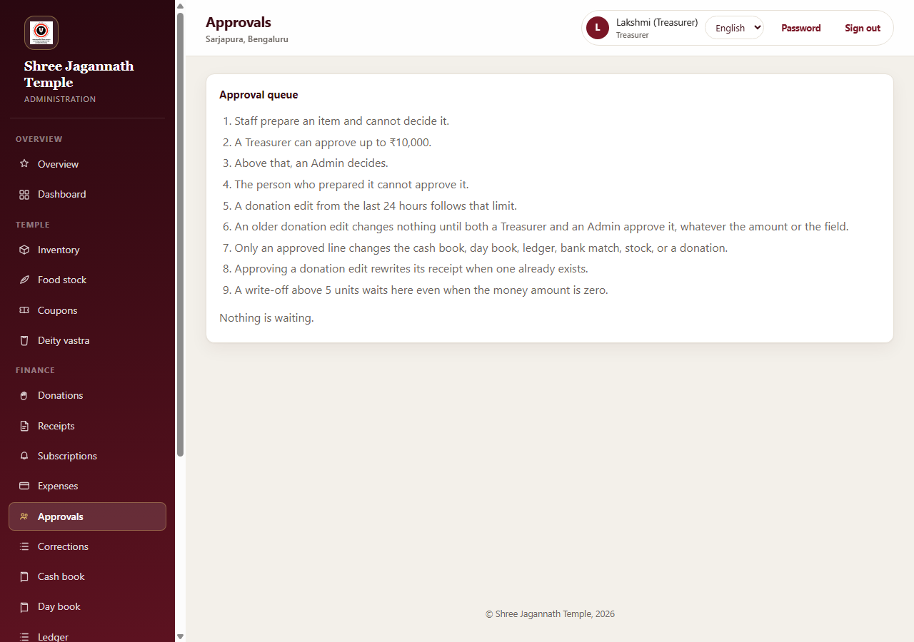

A Staff account sees the same registers. Staff can prepare work. Staff cannot approve it.

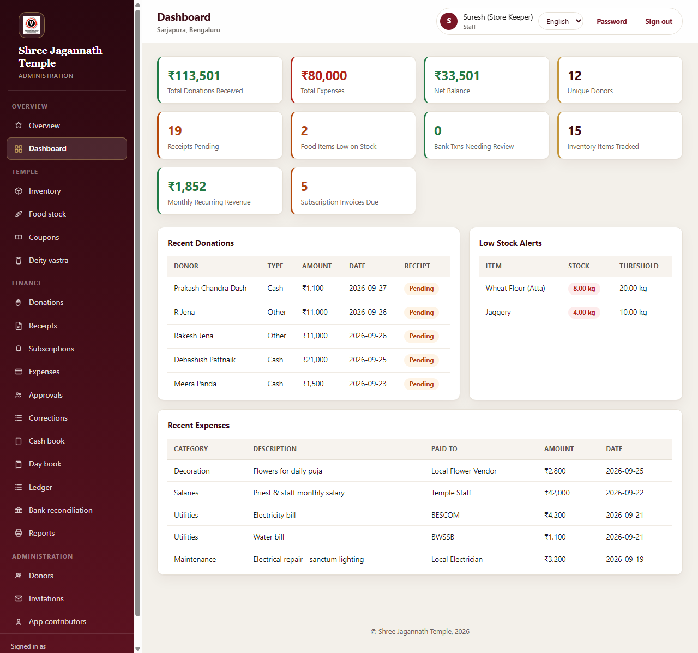

The person who prepared an item cannot approve that same item. Ask the other role to decide.

## How a line becomes part of the books

Most money that leaves the temple waits. A donation that has just been received does not wait. It is already money in hand.

States on a waiting line:

| State | Meaning |
| --- | --- |
| Draft | Started, not yet sent |
| Waiting | Sent for a decision |
| Approved | Posted. This is the only state that changes the cash book, day book, ledger, bank match, or stock |
| Sent back | Returned to the person who prepared it, with a note |
| Rejected | Refused. It does not change the books |

A write-off of stock above 5 units waits even when the money amount is zero.

## Dashboard

The dashboard is the morning view of the books: donations received, expenses, net balance, devotees, receipts still to print, low food stock, bank lines still to match, inventory, monthly seva, and invoices due. Recent gifts and recent expenses sit underneath.

Open a green receipt number to see that PDF.

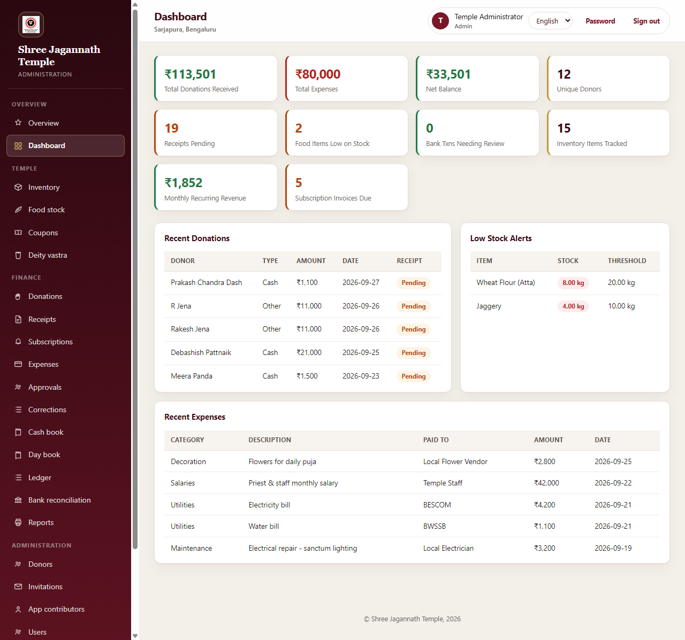

**Example.** Wheat flour is 8 kg and the minimum is 20 kg, so it is listed under Low stock alerts. Use that row as the cue to buy or to record a gift in kind before the kitchen runs short.

## Overview

Overview is one printable snapshot: recent gifts, stock, vastra, the subscription path from invoice to donation, and bank lines. Use it when a trustee wants the whole temple on one page.

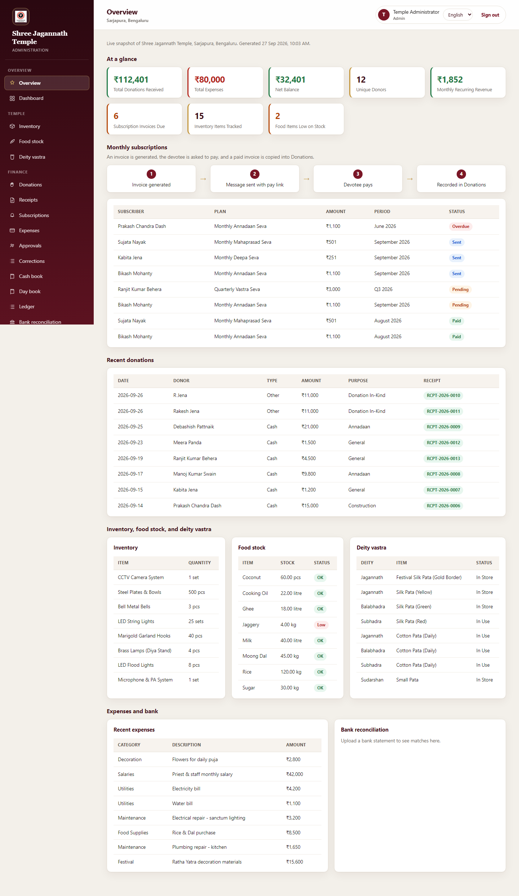

## Inventory

Inventory is equipment and stores that are not food and not vastra: vessels, chairs, lamps, lights, and so on. Each row has a category, quantity, unit cost, condition, location, and whether it was purchased or donated.

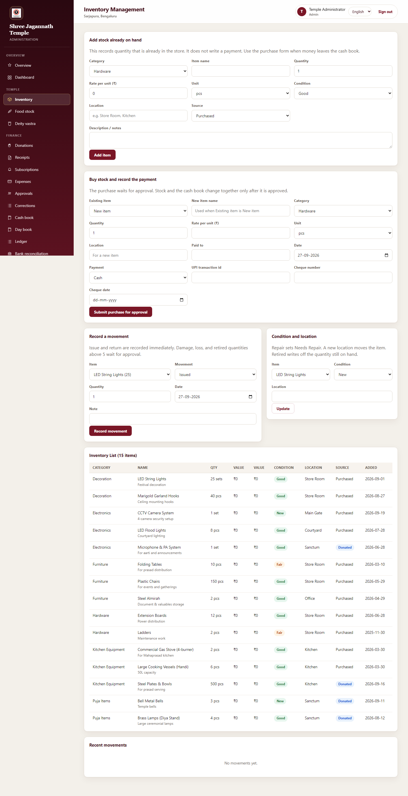

What you can do:

- Add an item. A purchase also writes the payment, but only after the purchase is approved. Until then the quantity does not rise.
- Issue or return stock. That is recorded at once.
- Mark damage, loss, or retired. Up to 5 units is recorded at once. Above 5 units it waits on Approvals, and the quantity stays until then.
- Change condition or location later. Needs Repair marks a repair. A new location moves the item. Retired writes off what is still on hand, and that write-off waits when it is above 5 units.
- The rate on hand becomes the weighted average of the old stock and a new purchase.

**Example.** The store has 150 plastic chairs. An event needs 20. Record an issue of 20. The quantity becomes 130 at once, because an issue does not wait. If 8 chairs are broken, that is above 5, so the loss waits for a Treasurer or an Admin. The 150 stays on the list until the loss is approved.

## Food stock

Food stock is rice, dal, ghee, and the rest of the kitchen, with a minimum level and a log of what was added or used. Kitchen use of 5 units or less is a normal log. Above that it waits for approval.

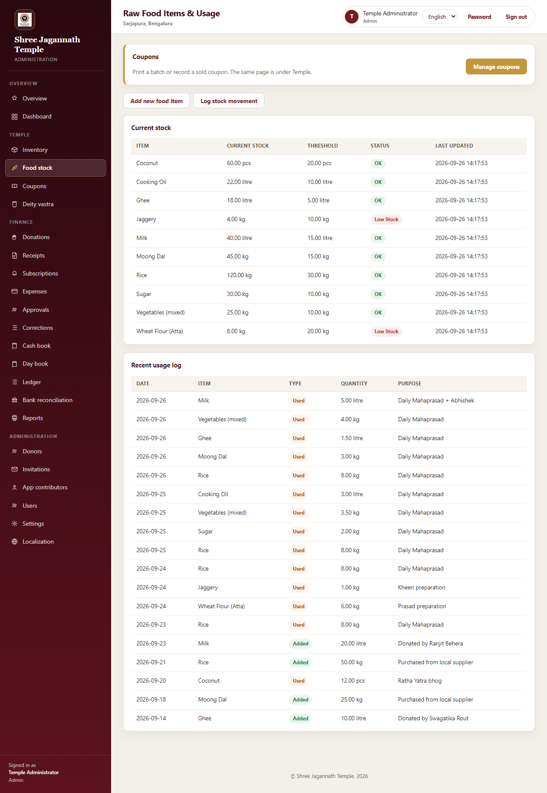

**Example.** The cook uses 8 kg of rice for the day's Mahaprasad. That is above 5 kg, so Staff records the use and it waits. After approval, the stock falls and the log shows the purpose.

## Food coupons

A coupon batch is a print run for prasad, puja, or another temple service. Each coupon in the batch is stored on its own. The face value, cost times quantity, waits for approval. That face value does not enter the books.

Income is recorded when a coupon is sold. Scan the QR code, type the code, or send it to the coupon API. The amount is added as a donation under the coupon name, and it posts to the cash book or the bank book on that date. Leave the devotee name blank to record the sale under Coupon counter.

A batch can expire at a date and time, or it can have no expiry. Once the expiry time has passed, the coupon is invalidated on its own and cannot be recorded as income. Invalidating a coupon by hand also adds no income.

A Treasurer can approve up to ₹10,000. Above that, an Admin decides. The person who prepared the batch cannot approve it. Print the PDF only after approval. Each coupon carries the serial `CU-` plus the time and a 4-digit number. The QR code is a link to that same coupon. Scanning it on a phone opens the register. If you are already signed in, the coupon is checked and, only when it is still valid, recorded as income. If you are not signed in, the sign-in page opens first, and the same check and recording happen after you sign in. A coupon that is waiting, already sold, invalidated, or past its expiry is not added. Print the batch again after this change so the sheet uses the link. If the QR should open the live site rather than this computer, set `APP_URL` in the server `.env` file to that site address, with no path, and print again. If the batch expires, the sheet also prints that time.

The name, cost, quantity, and expiry can be edited. A cost or quantity change sends the batch back for approval. An unapproved batch can be removed by anyone who can open the page. Only an Admin can remove a batch after it is approved. Removing a batch deletes its unused coupons. A batch that already has a sold coupon stays, because that donation is already in the books.

A signed-in person can call these addresses on `index.php`:

- `r=api/coupons/validate` records a sale. Send `code`, and optionally `donor_name`, `payment_mode`, and the UPI or cheque details.
- `r=api/coupons/invalidate` invalidates a code and does not add income.
- `r=api/coupons/status` reads one code.

Send JSON, or ordinary form fields. A program that is not using the browser session sends `Authorization: Bearer` and the coupon API token from the server `.env` file. The token is at least 16 characters. Without that token, only a signed-in session can call the API.

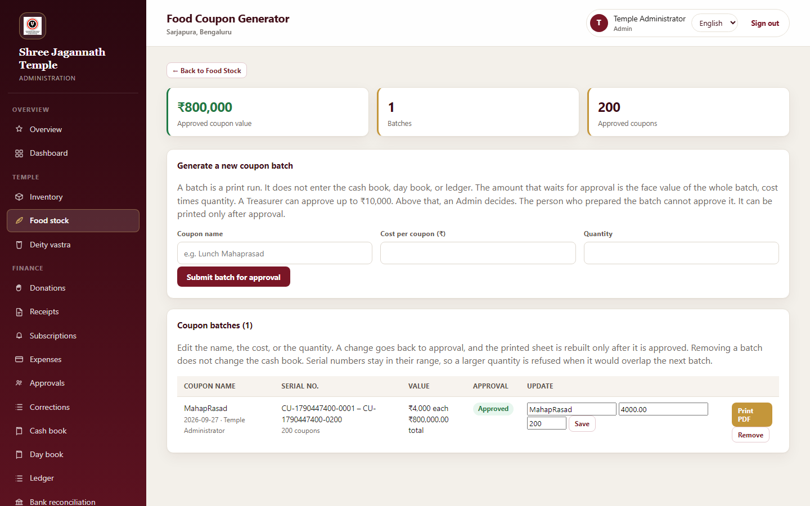

**Example.** Staff creates "Lunch Mahaprasad" at ₹50 each, quantity 100, with no expiry. Face value is ₹5,000, so a Treasurer can approve it. After approval, Print PDF builds the sheet. When one coupon is scanned or typed in, ₹50 is added as a donation and enters the cash book. The other 99 stay valid until they are sold or invalidated. If the quantity is later changed to 250, the face value becomes ₹12,500 and the batch goes back to Waiting for an Admin.

## Deity vastra

Vastra is cloth for the deities: deity, colour, quantity, source, and status In Store, In Use, or Retired.

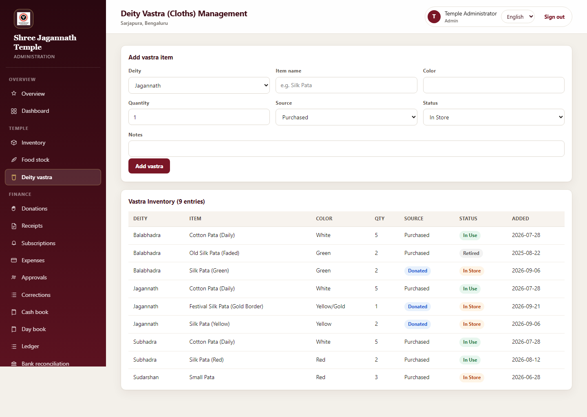

**Example.** A devotee gives two yellow silk patas for Jagannath. Record them as Donated, status In Store. When they are dressed on the deity, change the status to In Use. A faded set is marked Retired and stays on the list as history.

## Donations

Use Donations to record a gift. A repeat phone number matches the devotee already on file. Payment can be cash, UPI, bank transfer, cheque, card, netbanking, or in kind.

A cash gift posts at once. It does not wait for approval. An in-kind gift of food, vastra, or inventory updates that register as well.

A cheque stores its number, date, and whether it has cleared. A UPI payment stores the transaction id. Those references are what the bank match looks for.

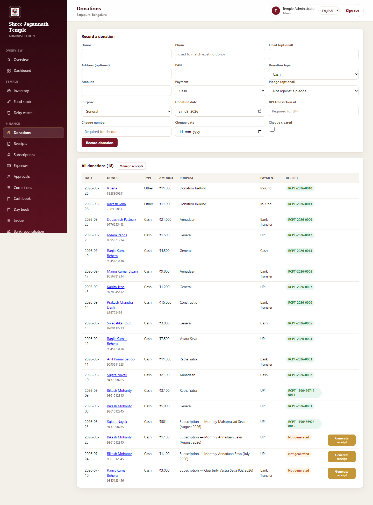

**Example.** Sujata gives ₹2,100 in cash for Annadaan. Enter her phone so she is not created twice, choose Cash, purpose Annadaan, and save. The gift is in the books immediately. If the receipt column says Not generated, use Generate receipt. The new number looks like `RCPT-` followed by the time and a 4-digit serial. Open the green number to see the PDF, which carries the temple name, the logo, and the watermark set under Settings.

## Receipts

Receipts lists every PDF that has been generated. Anyone signed in can open one. Email sends that PDF from the mail account saved in Settings. WhatsApp opens the devotee's chat with the receipt link. On a phone, the same button can also attach the PDF when the device can share a file.

The receipt PDF has a QR code. A devotee can scan it with a phone. The phone opens a page with the gift details: receipt number, date, name, amount, purpose, and payment. No sign-in is required. The page is not the PDF. That page closes with a thank-you and a namaste. On the receipt PDF, the same thank-you sits to the left of the QR code. A cancelled receipt still opens and is marked cancelled. The page does not show the phone number, email, address, or PAN.

Cancelling a receipt keeps the number and the file. It waits for approval. After approval the list shows it as cancelled. The money stays in the books. Deleting the file is not how a receipt is undone.

An Admin can download a zip of many receipts. Staff and Treasurer ask an Admin for that.

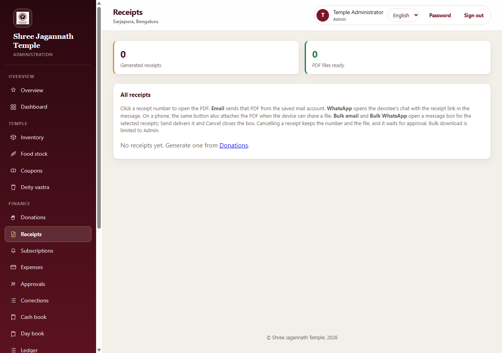

**Example.** Three receipts from last Sunday need to go to devotees who have email addresses. Tick those rows, write a short note, and use Bulk email. Anyone without an email address is skipped and named in the result. To undo one receipt that was issued in error, cancel it and ask a Treasurer or Admin to approve the cancellation.

## Devotees

Donors is the devotee list: name, phone, email, address, and PAN. Open a name for that person's ledger for the financial year. The ledger shows every gift, the receipt number, and the total received. In-kind gifts are listed and are not added to the money total. The page prints as the yearly statement.

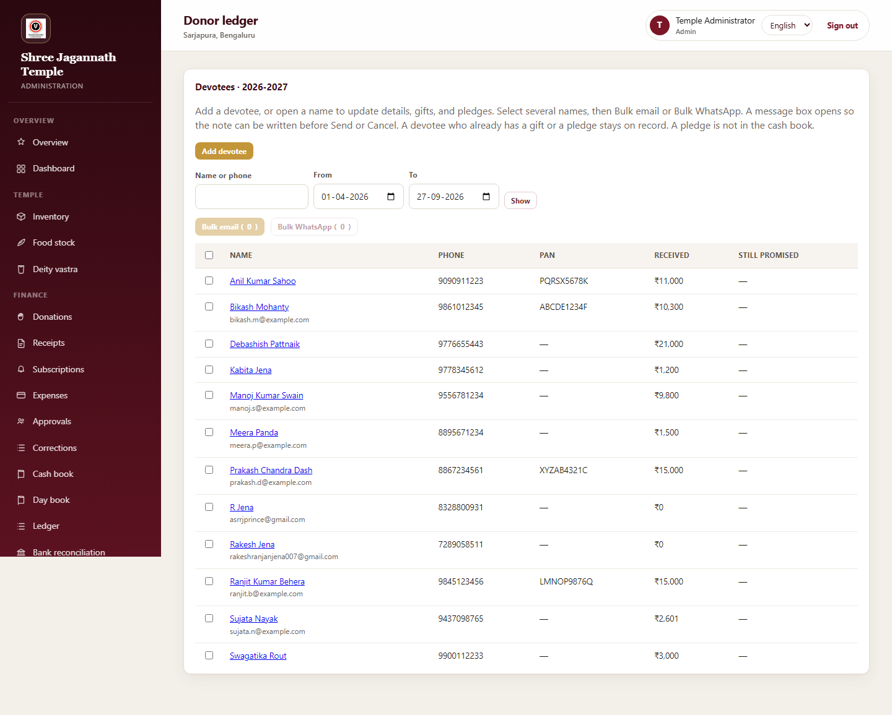

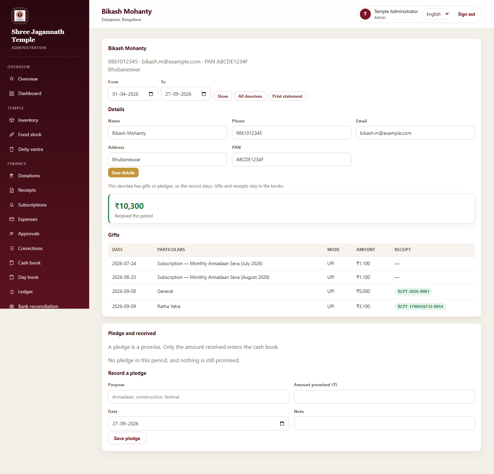

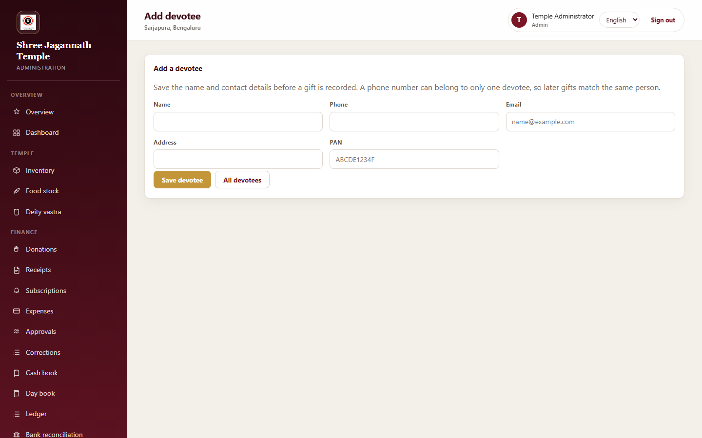

A pledge is a promise. The page shows promised, received, and still to come. Only the amount received enters the cash book.

**Example.** A devotee pledges ₹25,000 for Annadaan and pays ₹5,000 today. Record the pledge on the devotee page, then receive ₹5,000 against it. The cash book rises by ₹5,000. The statement still shows ₹20,000 to come.

Bulk email on the devotee list sends one note to the selected people who have an email address.

## Invitations

Invitations is a card you design on screen. Add a heading, words, a picture, or a video link. Bold, italic, and left, center, or right apply to the words. The card is what the devotee receives. A video is a link in the email, because mail apps do not play a video inside the message. Each email starts with that devotee's name.

Send opens the devotees who have an email address, and shows the address. Tick people one by one, or tick everyone. Send invitation sends the card in one click. Up to 100 people can be included at once. Someone without an email address is not on that list. Outgoing mail has to be saved under Settings before a message can leave.

## Subscriptions

Subscriptions are recurring seva: a plan, an amount, and a frequency. Generate an invoice, then send it. The message includes a payment link. When mail is saved under Settings, Send also emails that message. WhatsApp Web opens with the message filled in. There is no WhatsApp API. The devotee still confirms payment on the link.

The devotee opens the link without signing in. Confirming payment marks the invoice Paid and copies it into Donations.

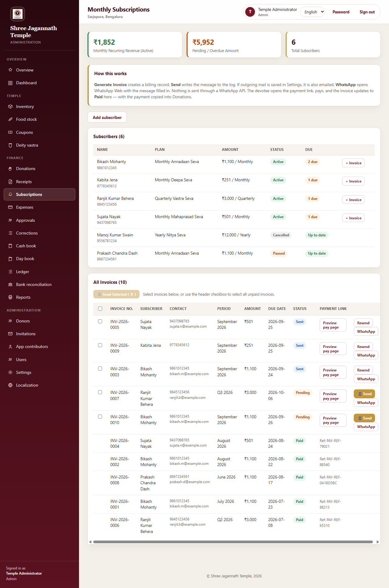

**Example.** Bikash's Monthly Annadaan Seva is ₹1,100. Generate the September invoice and send it. He opens the link and confirms. The invoice becomes Paid, and a ₹1,100 donation appears under his name with the purpose of that seva.

## Expenses

An expense has a category, who was paid, a date, a payment mode, and a voucher number for the financial year (`VCH-` plus the year and a serial). A bill can be noted or attached as a PDF or image.

A new expense waits for approval before it enters the books. A UPI expense stores the transaction id. A cheque stores its number, date, and whether it has cleared.

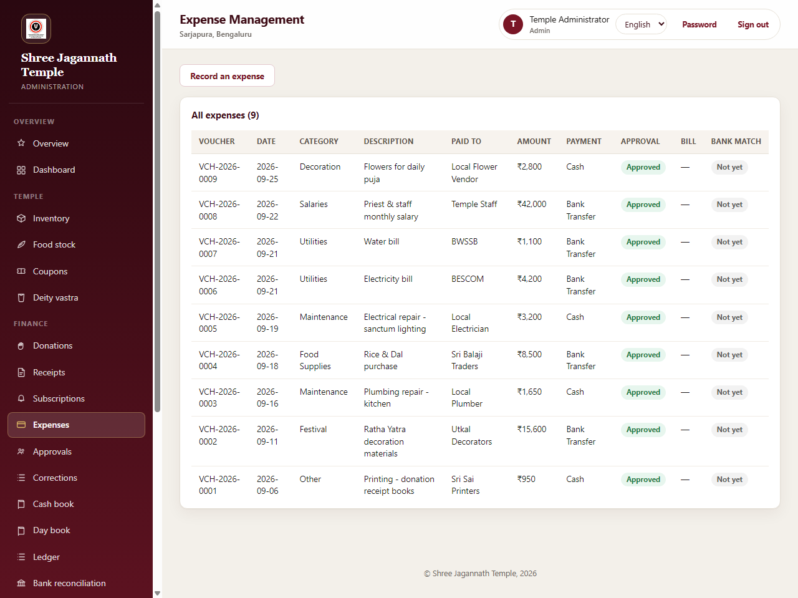

**Example.** Staff records ₹3,200 paid in cash to the electrician for sanctum lighting. It waits. A Treasurer who did not enter it can approve it, because it is under ₹10,000. The salary payment of ₹42,000 is above ₹10,000, so only an Admin can approve it. Until then it is not in the cash book.

## Approvals

Approvals is the queue for expenses, cash deposited or withdrawn, opening-balance changes, purchases, stock write-offs, corrections, receipt cancellations, and coupon batches.

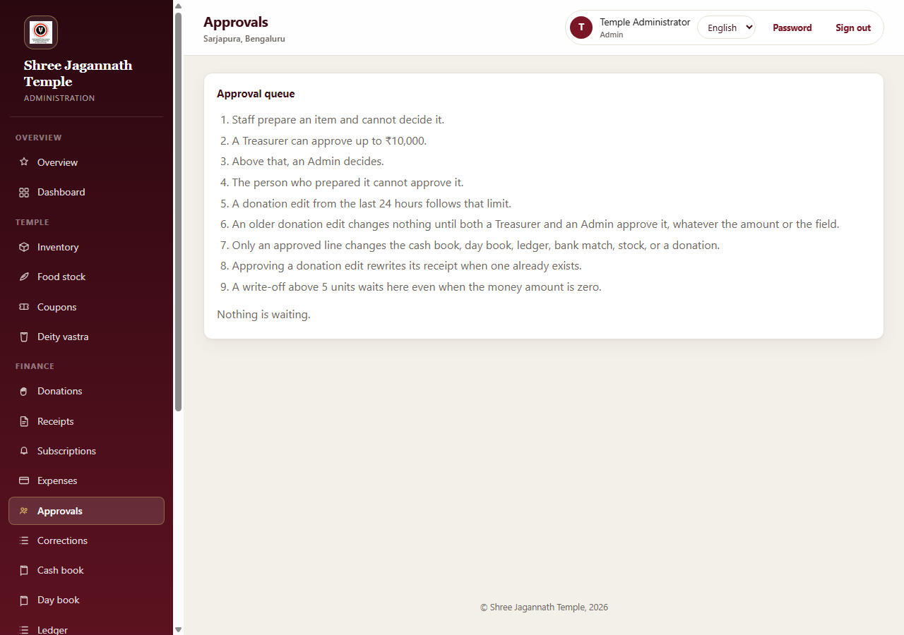

**Example.** Staff prepared the ₹3,200 electrician bill. Lakshmi opens Approvals, checks the amount is within ₹10,000, and approves it. She cannot approve a bill she entered herself. The ₹42,000 salary stays Waiting until an Admin approves it. After approval, the line appears in the cash book, day book, and ledger.

## Corrections

A correction keeps the original donation or expense and adds a second line with a reason. It changes the cash book, day book, and ledger only after approval. Voiding a line reverses the whole amount. Setting a new amount posts only the difference.

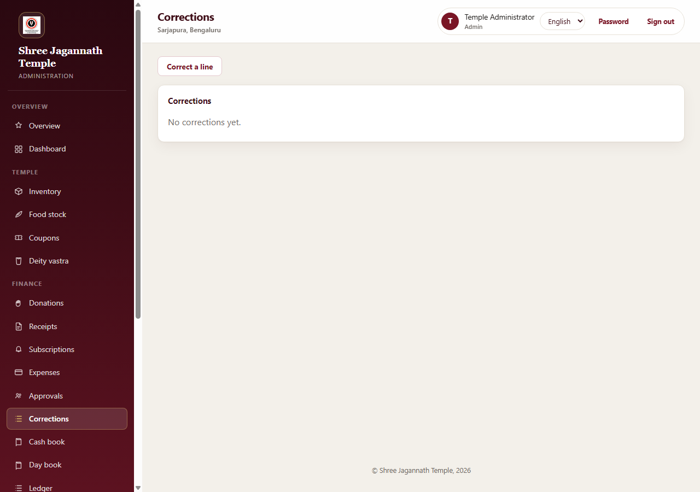

**Example.** A cash gift was entered as ₹5,000 and the count was ₹5,100. Record a correction from 5,000 to 5,100 with the reason. After approval, the books rise by ₹100. The original ₹5,000 line stays.

## Cash book

The cash book is one financial year, April to March. It has receipt and payment columns for cash and for bank, plus opening and closing balances. Movements before the chosen start date, but inside the same year, fold into the opening balance.

Cash gifts and cash expenses change cash. UPI, bank transfer, cheque, card, and netbanking change the bank. In-kind gifts stay out of the book.

A contra entry is cash deposited in the bank, or cash withdrawn. Both balances move, and the combined total does not. A contra entry waits for approval.

A Treasurer or Admin submits the opening cash and bank for the year. It changes the books only after someone else approves it. Until then, the year opens at zero.

Carry forward copies one year's closing cash and bank into the next year's opening. It uses the whole year, through 31 March, and it waits for approval. A negative closing is refused.

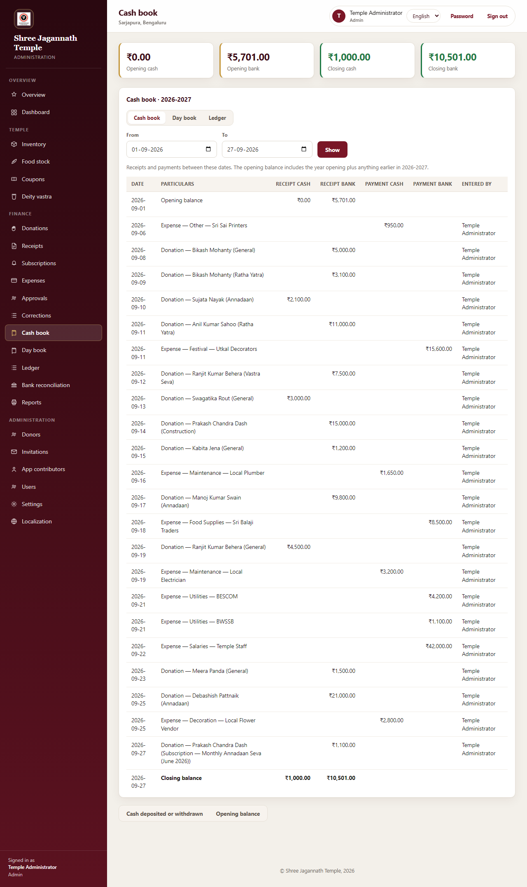

**Example.** On 6 April the counter has ₹10,000 that should go to the bank. A Treasurer records a deposit of ₹10,000. An Admin approves it. Cash falls by ₹10,000 and the bank rises by ₹10,000. The combined total is unchanged.

## Day book

The day book is the same period as one date-wise list, with who entered each line. Only approved lines are here, plus gifts that posted immediately.

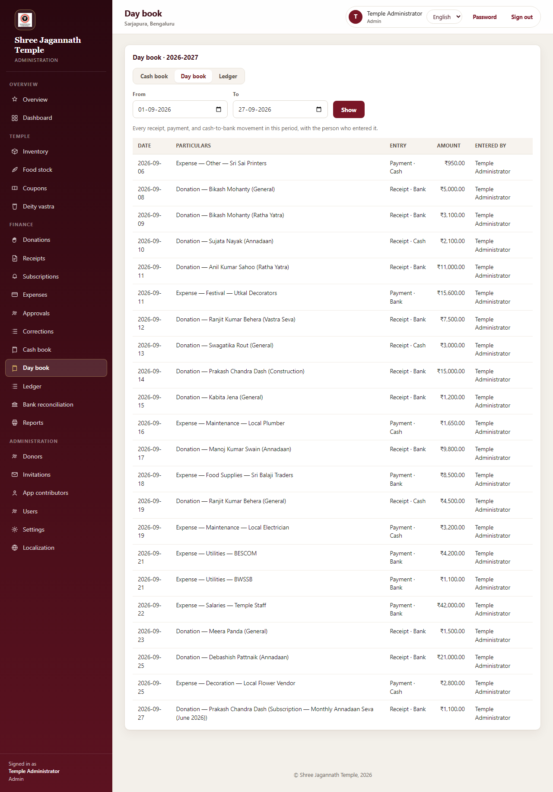

## Ledger

The ledger is by head for the financial year. A donation purpose and an expense category are each a head. Received money and spending are shown, with the balance. The same name shares one fund. In-kind gifts stay out.

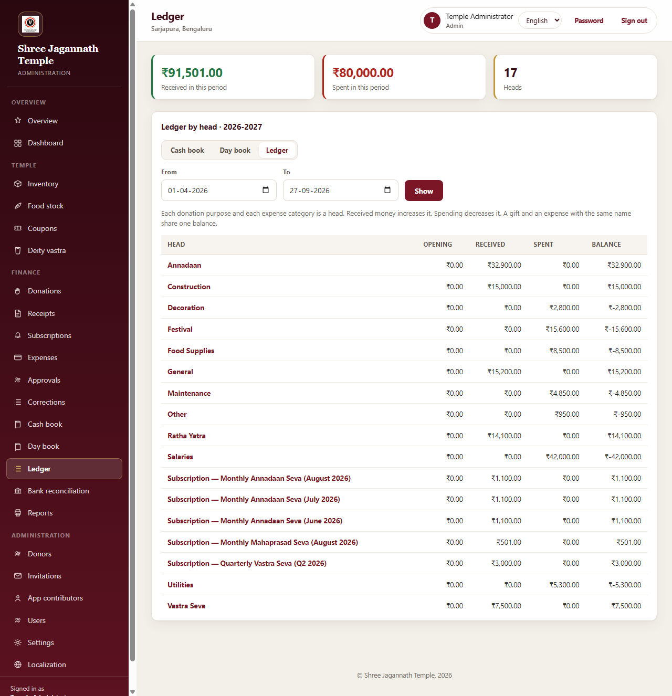

**Example.** Annadaan shows gifts received for that purpose and food purchases charged to it. The balance is what remains in that fund.

## Bank reconciliation

Upload a CSV or Excel bank statement. A credit matches a donation and a debit matches an approved expense. A UPI id or cheque number in the narration matches within 90 days. Otherwise the same amount matches within 3 days. Anything left over can be linked by hand.

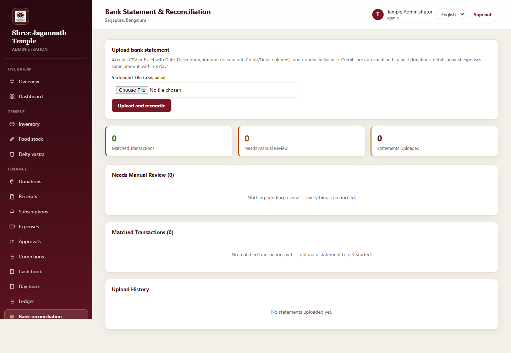

**Example.** The statement has a credit of ₹15,000 whose narration contains the UPI reference from a donation last week. That line matches on its own. A debit with no reference is linked by hand to the approved expense of the same amount.

## Reports

Reports print donations, expenses, inventory, food, vastra, and bank reconciliation. Donation and expense reports can be limited by date.

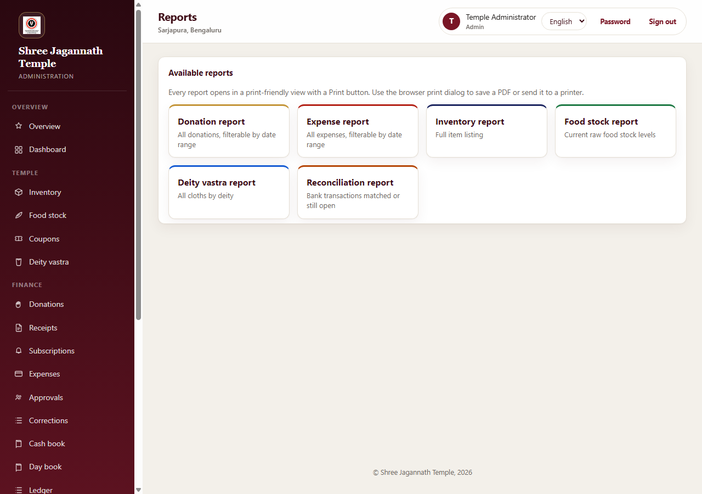

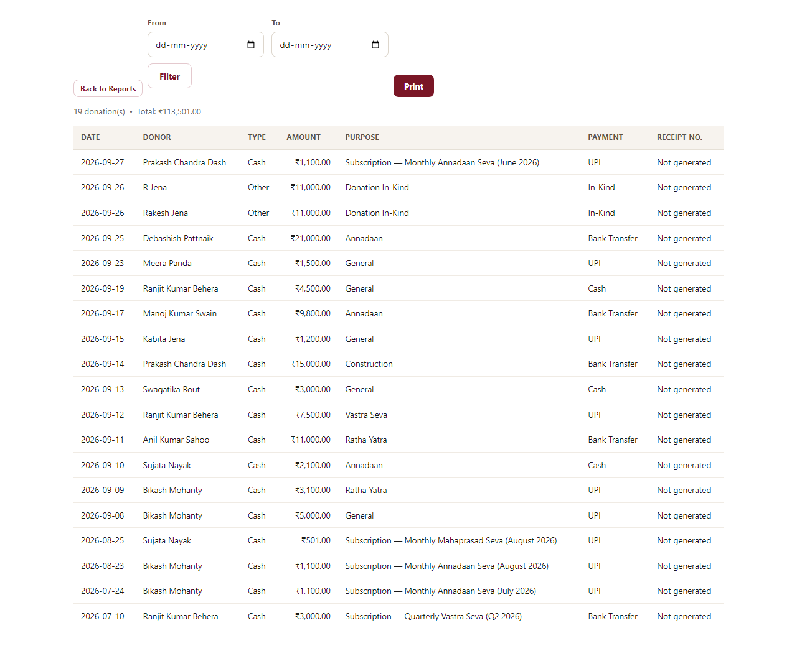

**Example.** For the trustee meeting, open the donation report, set the month, and print. The temple name and logo from Settings appear on the printed header.

## Users

Users is Admin only. An Admin adds an account and chooses Admin, Treasurer, or Staff. Passwords are stored hashed. At most 10 accounts can be active. The last active Admin cannot be deactivated.

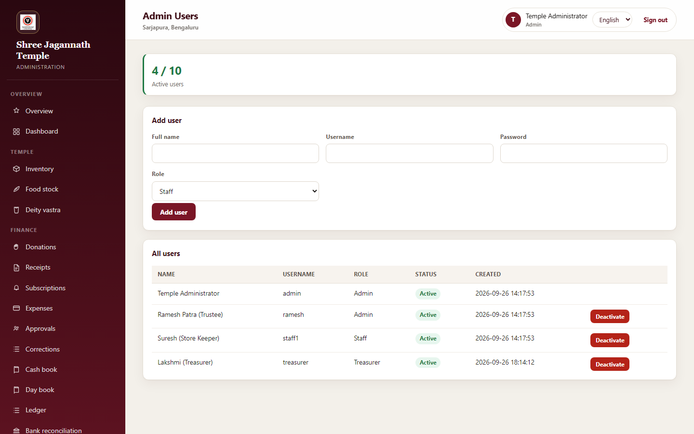

**Example.** A new store keeper joins. The Admin adds username `store2`, a password, the name, and the role Staff. When that person leaves, the Admin deactivates the account. The name remains on old lines they entered.

## Settings

Settings is Admin only. One card holds the temple name shown on screen, on receipts, on coupons, and in the email signature, plus the logo. The logo is also the faint watermark on receipts and coupons. Each watermark is a number from 0 to 100. 0 is invisible and 100 is solid.

The same page holds the outgoing mail server, the WhatsApp message, and the choice lists used on the forms. The mail password is kept and is not shown again. A name already in a list cannot be added twice. Names the forms rely on stay and cannot be removed.

The temple name, logo, and watermark levels are stored in that server's database. Saving them on one computer does not change the other server. After a new server is set up, open Settings there and save them once, then print the receipt and the coupon again.

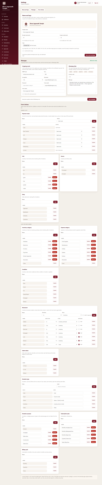

**Example.** The printed name should be the long temple name, and the logo should sit at 22 on receipts and 22 on coupons. Enter the name, upload the logo, set both watermark fields to 22, and save. Open an existing receipt again, or print the coupon batch again. The PDF is rebuilt with that name, logo, and watermark.

## Localization

Localization is Admin only. It changes labels, headings, and buttons for English, Hindi, and Odia. Devotee names, amounts, receipts, and the choices saved in Settings stay as they were entered.

**Example.** The Hindi label for Donations should say something clearer. Choose Hindi, find that phrase, type the new words, and save. The menu in Hindi uses the new label. The devotee names in the table do not change.

## A morning's work, by role

**Staff.** Sign in. Check low stock on the dashboard. Record the morning's gifts on Donations and generate any missing receipts. Log kitchen use of 5 kg or less directly. Send anything larger to Approvals. Enter the electrician's bill. Leave the queue for the Treasurer.

**Treasurer.** Open Approvals. Approve the kitchen use and the electrician's bill, because both are within ₹10,000 and someone else prepared them. Leave the salary line for an Admin. If the year is opening, submit the opening cash and bank, and ask an Admin to approve it.

**Admin.** Approve anything above ₹10,000, including a large coupon batch. Save the temple name, logo, and watermarks if they are not yet on this server. Add or deactivate accounts when people join or leave. Download a zip of receipts when the office needs a bundle.
